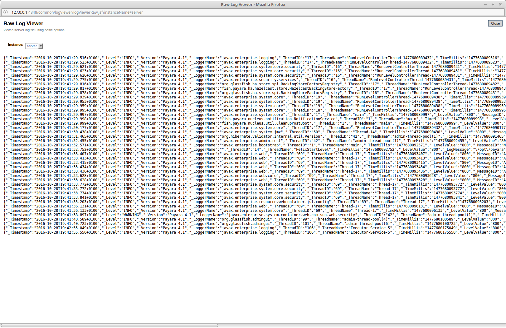

[[json-log-formatter]]
JSON Log Formatter
------------------

_Since version 4.1.1.164_

Besides ULF and ODL logging formats available also in GlassFish 4,
Payara Server provides additional JSON format. With this format, every
line in the log output is formatted as a JSON string. The log records
can be then easily parsed by a JSON parser for further data processing.

To enable the JSON formatter using the Admin Console, just select `JSON`
from the list of Logging Formats, either for `Console` or `Log File`:

image:images/json_config.png[JSON format configuration in Web Console]

The following command will enable the JSON formatter using the `asadmin`
tool:

----------------------------------------------------------------------------------------------------------------------------------------------
asadmin> set-log-attributes com.sun.enterprise.server.logging.GFFileHandler.formatter='fish.payara.enterprise.server.logging.JSONLogFormatter'
----------------------------------------------------------------------------------------------------------------------------------------------

Once JSON formatter is enabled, the log file may look like this:

