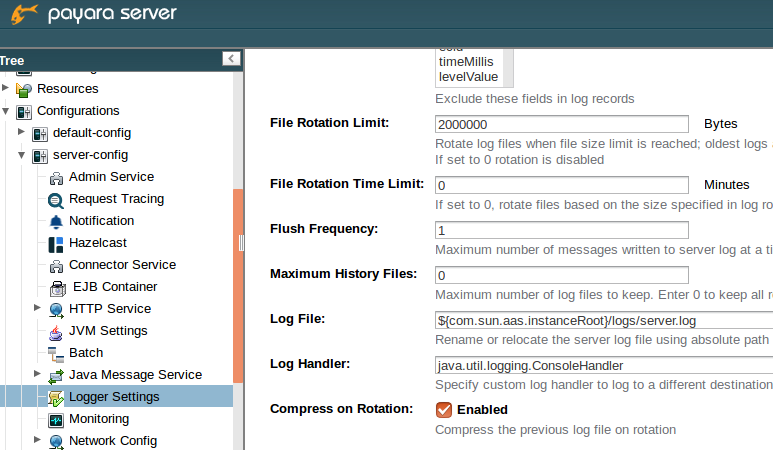

[[compression-of-log-files-on-rotation]]
Compression of log files on rotation
------------------------------------

_Since version 4.1.1.164_

Both Payara Server and GlassFish 4.0 Open Source Edition provide option
to rotate files after configurable interval (given either by the size of
the log file or by time elapsed). On top of that, Payara Server can be
configured to compress rotated files automatically. This is done
transparently, so that it is still possible to view the log history in
the log viewer in the Web Admin Console, even from compressed files.

[[using-web-admin-console]]
Using Web Admin Console
~~~~~~~~~~~~~~~~~~~~~~~

When log rotation is configured, you can turn on compression of rotated
files in the `Logger Settings` section, by ticking
`Compress on Rotation` checkbox:

[[using-asadmin-utility]]
Using `asadmin` utility
~~~~~~~~~~~~~~~~~~~~~~~

With `asadmin` utility, the same can be achieved by setting the
respective log attribute to either `true` or `false`:

-----------------------------------------------------------------------------------------------------
asadmin> set-log-attributes com.sun.enterprise.server.logging.GFFileHandler.compressOnRotation='true'
-----------------------------------------------------------------------------------------------------

[[view-the-log-files-in-the-admin-console]]
View the log files in the Admin Console
~~~~~~~~~~~~~~~~~~~~~~~~~~~~~~~~~~~~~~~

The log files can be viewed in Admin Console in the same way as if they
were uncompressed. The only difference is that their name ends in `.gz`
extension and it takes much longer to open them and display their
contents.

This is an example how the Log Viewer may look like with 3 compressed
log files:

image:images/zipped_logs.png[Log Viewer with compressed log files]
