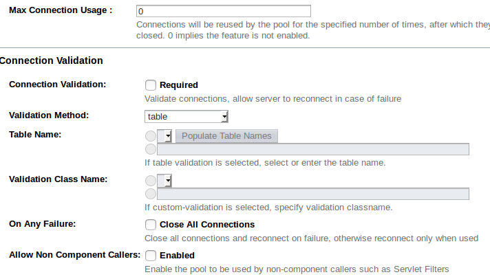

# Connection validation

Connection validation ensures that connections aren't assigned to your application after the connection has already gone stale.

Connection validation is always a trade-off between how sure you want to be that a connection is valid and the performance impact from validation. There will be a negative performance impact by having to return an invalid connection by your application and borrow a new one, so finding the right balance is key.

Before using a connection from the pool a simple query is sent to test the connection. If there is an issue with the connection it is removed from the pool and another one is used. If you have an issue such as the database being down and you have a large number of connections then each of those connections will be tested and removed.

In order to avoid this, you can set connection validation so that if a connection fails all connections are closed.

## Set up the validation via the admin console

1. Click on the name of the pool
2. Select the advanced tab
3. Scroll down to Connection Validation and select the following settings:
   - Connection Validation required
   - Validation method - custom-validation
   - Validation class name – a proper class name for the chosen JDBC driver, such as  `org.glassfish.api.jdbc.validation.DerbyConnectionValidation` for a Derby DB

From the same screen, you can also set whether to close all connections on failure.



## Set up the validation using asadmin

To turn on connection validation :

```bash
asadmin> set resources.jdbc-connection-pool.test-pool.connection-validation-method=custom-validation

asadmin> set resources.jdbc-connection-pool.test-pool.validation-classname= org.glassfish.api.jdbc.validation.DerbyConnectionValidation

asadmin> set resources.jdbc-connection-pool.test-pool.is-connection-validation-required=true
```

You can also set whether to close all connections on failure with the following command:

```bash
asadmin> set resources.jdbc-connection-pool.test-pool.fail-all-connections=true
```
